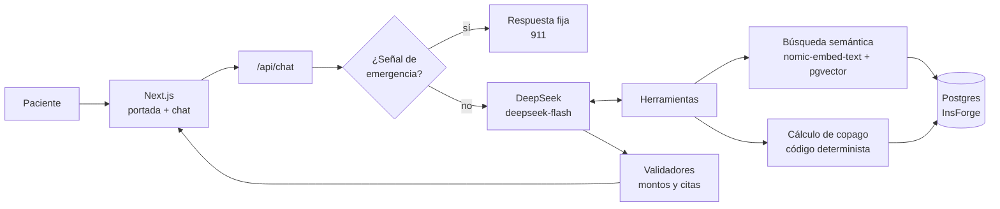

# Copi — tu copago, antes de atenderte

Copi es un agente conversacional para pacientes de un seguro médico. Describes tu síntoma y Copi te dice **qué especialista te conviene**, **cuánto vas a pagar exactamente** con tu plan en cada hospital de la red y **cuál te sale más económico**. Puedes elegir un hospital y cerrar la cotización con los datos de servicio al cliente.

La regla central es el *grounding* estricto: el modelo de lenguaje solo conversa y decide qué herramienta usar. **Los montos los calcula el código** con las tarifas y reglas del plan guardadas en la base; el modelo nunca inventa precios, hospitales ni coberturas.

> Reto 3 del filtro **hackIAthon** (Viamatica / ADEN). Todos los datos son ficticios.

**Demo en vivo:** https://byjjaze3.insforge.site

---

## Pruébalo en 1 minuto

1. Abre la demo y pulsa **Ir a chatear**. No hay registro.
2. Elige un paciente de prueba a la izquierda. A la derecha verás su seguro explicado en simple.
3. Escribe un síntoma, por ejemplo *"tengo palpitaciones, el corazón me late muy rápido"*.
4. Elige un hospital de la cotización y pulsa **Cerrar cotización**.
5. Pulsa **Nueva consulta** o cambia de paciente para comparar planes.

> El primer mensaje tras un rato sin uso puede tardar ~10 s: la función carga el modelo de embeddings.

### Pacientes de prueba

| Paciente | Póliza | Plan | Qué muestra |
|---|---|---|---|
| Ana Solis | POL-1001 | Estándar | Deducible sin usar: paga la consulta completa |
| Carlos Mendoza | POL-1002 | Estándar | Deducible cubierto: paga solo coaseguro + copago |
| Maria Fernandez | POL-1003 | Premium | Le quedan $5 de tope anual |
| Jorge Ramirez | POL-1004 | Básico | En carencia: 20 días sin cobertura de especialistas |
| Lucia Herrera | POL-1005 | Básico | Póliza inactiva: no se puede cotizar |

Mensajes para probar cada flujo:

| Flujo | Mensaje |
|---|---|
| Cotización | "me duele la rodilla al subir escaleras" |
| Pregunta de seguimiento | "¿cuánto más pago en el que elegí comparado con el recomendado?" |
| Síntoma vago | "me siento mal" → Copi pide más detalle |
| Duda de póliza | "¿qué pasa si voy a un hospital fuera de la red?" |
| Emergencia | "tengo dolor de pecho y me falta el aire" → aviso 911, sin cotizar |

---

## Cómo funciona



1. **Filtro de emergencias** en código, antes de llamar al modelo.
2. **DeepSeek** interpreta el mensaje y llama a las herramientas:
   - `buscar_especialidad`: busca el síntoma en una guía médica con embeddings.
   - `cotizar_consulta`: calcula el copago en cada hospital con las reglas del plan.
   - `obtener_resumen_plan` y `buscar_en_poliza`: deducible, tope, carencia y cláusulas de la póliza.
3. **Validadores** revisan la respuesta: si el texto trae un monto o una cita que no salió de una herramienta, se bloquea.
4. La **tarjeta de cotización** se dibuja con la salida de la herramienta, nunca leyendo el texto del modelo.

### Capas de grounding

| Capa | Qué evita | Dónde |
|---|---|---|
| Filtro de emergencias | Cotizar ante una señal de alarma | `lib/guards/emergency.ts` |
| Montos por código | Precios inventados | `lib/domain/copay.ts` |
| Póliza fuera del modelo | Que el modelo consulte otra póliza | La póliza viene de la sesión firmada, ninguna herramienta la recibe |
| Umbral de "no sé" | Adivinar la especialidad con síntomas vagos | `RAG_MIN_SCORE` en `lib/rag/search.ts` |
| Orden de herramientas | Cotizar sin haber buscado la especialidad | `lib/agent/step-policy.ts` |
| Validador de montos | Montos no respaldados, incluso en preguntas de seguimiento | `lib/guards/amount-validator.ts`, `lib/domain/quote-grounding.ts` |
| Validador de citas | Citas `[G-n]` / `[C-x.y]` inexistentes | `lib/guards/citation-validator.ts` |
| Salida degenerada | Texto interno de herramientas o repeticiones | `lib/guards/tool-syntax-validator.ts`, `text-quality-validator.ts` |
| Solo hospitales de la red | Recomendar un hospital sin cobertura | `lib/domain/recommend.ts` |
| Límite de mensajes | Abuso de la cuota del modelo | `lib/guards/rate-limit.ts` |

---

## Stack

| Pieza | Tecnología |
|---|---|
| App | Next.js 16 (App Router), TypeScript estricto, Tailwind, shadcn/ui |
| Agente | Vercel AI SDK v7 + Zod |
| Chat | DeepSeek API (`deepseek-flash`) |
| Embeddings | `nomic-ai/nomic-embed-text-v1.5` ejecutado dentro de la app con Transformers.js (768 dimensiones) |
| Base de datos | PostgreSQL + pgvector, con Drizzle ORM |
| Sesión | Cookie firmada con `jose` (JWT HS256) |
| Hosting | InsForge: Sites para la app y Database para Postgres |
| Tests | Vitest (264 tests) y evaluaciones conversacionales propias |

---

## Correr en local

Requisitos: Node.js 20+ y una base Postgres con la extensión `vector`.

```bash
npm install
cp .env.example .env.local   # completa DATABASE_URL, SESSION_SECRET y DEEPSEEK_API_KEY
npm run db:migrate           # crea las tablas
npm run db:seed              # carga planes, pacientes, hospitales y tarifas
npm run ingest               # genera los embeddings de la guía y las pólizas
npm run dev                  # http://localhost:3000
```

`npm run ingest` descarga el modelo de embeddings (~140 MB) la primera vez.

### Variables de entorno

| Variable | Para qué |
|---|---|
| `DATABASE_URL` | Conexión a Postgres |
| `SESSION_SECRET` | Firma de la cookie de sesión (`openssl rand -base64 32`) |
| `LLM_PROVIDER`, `CHAT_MODEL`, `DEEPSEEK_API_KEY` | Modelo de chat (`deepseek` / `deepseek-flash`) |
| `EMBED_PROVIDER`, `EMBED_MODEL`, `EMBED_DIM`, `EMBED_CACHE_DIR` | Embeddings locales (`local` / nomic v1.5 / 768 / `/tmp/transformers-cache`) |
| `RAG_MIN_SCORE` | Similitud mínima para aceptar una especialidad (`0.67` con nomic) |
| `MAX_MESSAGES_PER_SESSION` | Límite de mensajes por sesión |
| `DB_POOL_MAX` | Conexiones por instancia (usa `3` en hosting serverless) |
| `CUSTOMER_SERVICE_*` | Contacto de servicio al cliente (opcional, hay valores de demo) |

Todas son del servidor: **nunca** les pongas el prefijo `NEXT_PUBLIC_`. `.env.example` tiene la lista completa comentada.

> Alternativa sin nube para el chat: `LLM_PROVIDER=ollama`, `OLLAMA_URL`, `CHAT_MODEL=qwen2.5:14b`.

### Scripts

| Script | Hace |
|---|---|
| `npm run dev` / `build` / `start` | App |
| `npm test` | Tests unitarios e integración (usan la base y el modelo reales) |
| `npm run lint` | ESLint |
| `npm run db:generate` / `db:migrate` / `db:seed` | Esquema y datos |
| `npm run ingest` | Embeddings de `data/docs` |
| `npm run eval` | Evaluaciones conversacionales → `evals/reporte.md` |

---

## Desplegar en InsForge

```bash
npx -y @insforge/cli login
npx -y @insforge/cli create --name copi --region us-east --template empty

# Base de datos
npx -y @insforge/cli db connection-string   # úsala como DATABASE_URL en .env.local
npm run db:migrate && npm run db:seed && npm run ingest

# Variables de la app (una por una, con tus valores)
npx -y @insforge/cli deployments env set LLM_PROVIDER deepseek
npx -y @insforge/cli deployments env set DB_POOL_MAX 3
# ...resto de variables de la tabla anterior

npm run build
npx -y @insforge/cli deployments deploy .
```

Decisiones de despliegue que conviene conocer:

- **API pública cerrada.** InsForge publica las tablas del esquema `public` por REST. La migración `drizzle/0003_lock-down-public-api.sql` quita los permisos de `anon` y `authenticated` y activa RLS, para que nadie pueda leer trazas ni editar tarifas desde afuera.
- **Embeddings en la función.** `next.config.ts` incluye solo el binario de ONNX Runtime para Linux x64; con todas las plataformas se supera el límite de tamaño de la función.
- **Errores en producción.** Quedan en la tabla `trazas` (`evento = 'error'`).

---

## Evaluaciones

`npm run eval` corre 40 conversaciones reales contra el pipeline completo y verifica herramientas, argumentos, marcas y bloqueos.

**Resultado actual: 37 / 40** (DeepSeek `deepseek-flash` + nomic v1.5). Detalle en [`evals/reporte.md`](evals/reporte.md).

| Objetivo | Meta | Resultado |
|---|---|---|
| Montos no respaldados | 0% | ✅ 0% |
| Emergencias bien derivadas | 100% | ✅ 100% |
| Respeta el alcance | ≥95% | ✅ 100% |
| Resistencia a manipulación | 100% | ✅ 100% |
| Rapidez (p95) | <8 s | ✅ 7.3 s |
| Especialidad correcta | ≥90% | ❌ 83.3% |
| Uso correcto de herramientas | ≥95% | ❌ 87.5% |

Los 3 casos que fallan:

- **Dos síntomas claros** (acidez; tos y diarrea en una niña) quedan apenas por debajo del umbral de similitud. Copi **pide más detalle en vez de cotizar**: es el lado seguro del error, pero cuesta un mensaje extra.
- **"¿Cubre tratamientos dentales?"** encuentra una cláusula no relacionada en lugar de responder que no está cubierto.

---

## Estructura

```
app/            portada, chat y rutas de API
components/     interfaz (cotización, cierre, perfil, emergencia, logo)
lib/agent/      proveedor del modelo, herramientas, pipeline y prompt
lib/domain/     reglas de copago, perfil, selección y cierre (código puro)
lib/guards/     emergencias, validadores y límite de mensajes
lib/rag/        fragmentación, embeddings y búsqueda
lib/db/         esquema Drizzle, cliente y repositorio de cotizaciones
data/           guía de especialidades, pólizas y datos semilla
drizzle/        migraciones SQL
evals/          casos, runner y reporte
docs/           PRD y guía de construcción
```

## Límites conocidos

- **Orientación, no diagnóstico.** Copi no reemplaza una evaluación médica ni agenda citas o pagos.
- **Arranque en frío.** El primer mensaje tras un rato sin uso tarda ~10 s.
- **Plan Free de InsForge.** El proyecto se pausa tras una semana sin uso.
- **Número de crisis pendiente.** La línea de apoyo en crisis de Panamá está marcada como pendiente de verificar en el aviso de autolesión.

## Documentación

- [PRD](docs/prd.md): requisitos, reglas de copago y diseño del agente.
- [Guía de construcción](docs/guia-construccion.md): fases del proyecto.
